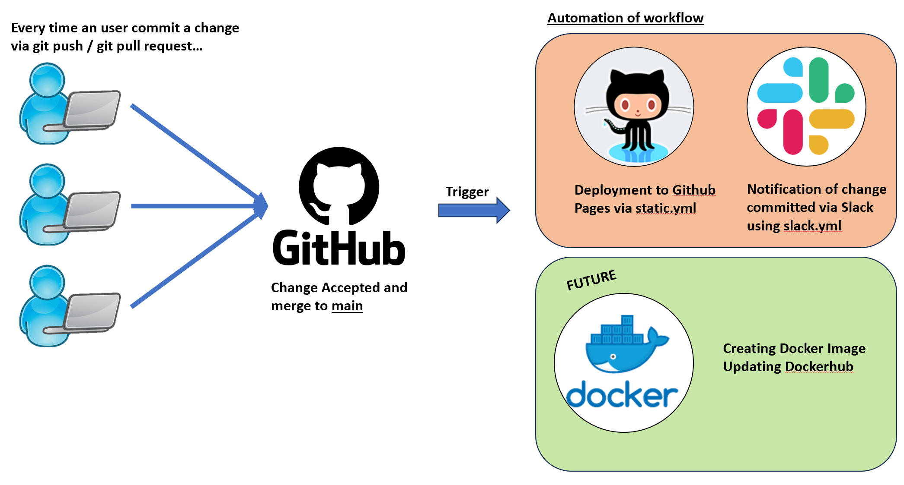

# fintechL3P1_showtell
Project for Fintech L3 P1 show-tell presentation

## Objective of the DevOps project: 
* To automate a series of workflow that executed itself when users triggered a git push / pull_request; stimulating a CI/CD pipeline in DevOps.
* To familiarise with Github workflow.

## Workflow Structure

To trigger the workflow, a simple website with a GCD calculator are built using html v5.0, css, and javascript. Changes made through Github push and pull request served as the trigger to kickstart the workflow. 

### 1. **Deployment of Static Pages via Github Pages [static.yml]**
From the course, static pages deployment can be achieved simply from Github Pages Tabs under Setting from Github.

Similarly, Github Actions to deploy a static page can be done through a .yml file under .github/workflows folder; which was the method used in this project. 

A git push / pull request will trigger the automatic deployment of static pages which can be found under the link: https://lijianxu1406.github.io/fintechL3P1_showtell/

Issue faced: If Github Pages are implemented before the creation of index.html file or lack of index.html file, the static page deployed will be based on the readme.md file. This can be rectify through the naming of the desired webpage-to-be-displayed to index.html. 

### 2. **Slack Notification on committed changes**

A slack.yml are used to trigger a notification message to be sent to the owner’s slack upon commited change.

This exercise introduces the use of Github Secret in storing and encrypting privacy data that user do not wish to share to the public. At the same time, it provide exposure to the automation of notification used to trigger message to slack, whatapps via twilio, and telegram via botfather. Slack is used in this demonstration due to personal and security preferences.  

### 3. **Automation of Building and Pushing Docker Image to Dockerhub**
Attempts to build and push docker image to dockerhub is currently facing some obstacles. Initial attempts ended in failure, mainly due to indentation issue in .yml file, as well as, lack of dockerfile before commencing on the workflow automation. 

Example of error as shown:

Moving forwards, I will attempt to automate the docker image build and push to dockerhub to complete a pipeline that automate the building and deployment of website to github pages and dockerhub whenever users make a git push / pull-request. 

